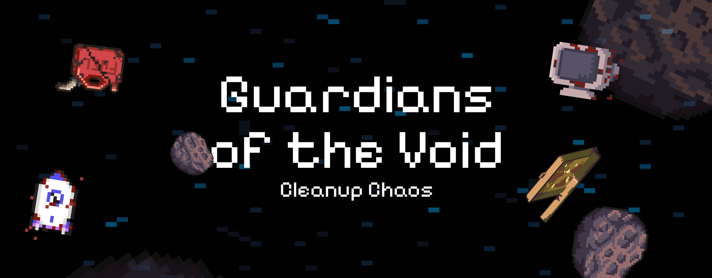

<div align="center">



# Guardians of the Void: Cleanup Chaos
**Guardians of the Void: Cleanup Chaos** is an exciting 2D space game built with Phaser 3 and TypeScript. Navigate through asteroid fields, collect space debris, and clean up the cosmos while avoiding dangerous obstacles. Features both story-driven levels and endless arcade mode!

<a href="https://github.com/lvl-Devs/cleanup-chaos/pulls"><kbd> <br> Contribute <br> </kbd></a>
<a href="https://github.com/lvl-Devs/cleanup-chaos/issues"><kbd> <br> Report Issues <br> </kbd></a>
<a href="https://lvl-devs.itch.io/cleanup-chaos"><kbd> <br> Play the Game <br> </kbd></a>

</div>

## 🚀 Features
• **Responsive Fullscreen Gaming**: Optimized for all screen sizes with automatic scaling  
• **Two Game Modes**: Story-driven level progression and challenging arcade mode  
• **Power-Up System**: Collect shields, speed boosts, and double points to enhance gameplay  
• **Progressive Difficulty**: Multiple levels with increasing challenges and obstacles  
• **Audio Experience**: Immersive sound effects and background music  
• **Local Storage**: Save your progress and high scores automatically  
• **Intuitive Controls**: Keyboard controls (WASD/Arrow keys) with smooth ship movement  

## 🎮 The Game
Guardians of the Void puts you in control of a space cleanup vessel tasked with collecting debris while navigating through dangerous asteroid fields. The game combines action-packed gameplay with environmental themes, challenging players to clean up space while surviving increasingly difficult obstacles.

### 🕹️ How to Play
• **Movement**: Use WASD keys or arrow keys to navigate your ship  
• **Objective**: Collect space debris (trash) to earn points  
• **Avoid**: Asteroids that will damage your ship  
• **Power-ups**: Collect special items for temporary abilities:
  - 🛡️ **Shield**: Temporary invulnerability  
  - ⚡ **Speed Boost**: Increased movement speed (hold SPACE to activate)  
  - 💎 **Double Points**: Earn twice the score for collected items  
  - ❤️ **Heart**: Restore health  
• **Pause**: Press ESC to pause the game  
• **Lives**: You have 3 hearts - lose them all and it's game over!  

### 🎯 Game Modes
• **Story Mode**: Progress through carefully designed levels with specific objectives  
• **Arcade Mode**: Endless gameplay with increasing difficulty for high score challenges  

## 🌐 Technologies Used
• **Phaser 3**: Powerful HTML5 game framework for 2D game development  
• **TypeScript**: Type-safe JavaScript for robust game logic  
• **Webpack**: Module bundler for efficient asset management and building  
• **npm/pnpm**: Package management and build automation  

## 🛠️ Development

### 📋 Prerequisites
- [Node.js](https://nodejs.org/) (>= 12)
- [npm](https://www.npmjs.com/) or [pnpm](https://pnpm.io/)

### 🔧 Installation
1. Clone the repository:
```bash
git clone https://github.com/lvl-devs/cleanup-chaos.git
cd cleanup-chaos
```

2. Install dependencies:
```bash
npm install
```

3. Start the development server:
```bash
npm start
```

4. Build for production:
```bash
npm run build
```

5. Serve the built game:
```bash
npm run serve
```

6. Deploy to itch.io:
```bash
npm run deploy
```

### 🚀 Deployment
The project is configured to deploy automatically to itch.io using Butler. 
> **⚠️ IMPORTANT**: Deployment is restricted to project administrators only. Regular contributors cannot deploy the game.

#### For Administrators Only:
To set up deployment credentials:

1. Install Butler (if not already installed):
```bash
curl -L -o butler.zip https://broth.itch.ovh/butler/linux-amd64/LATEST/archive/default
unzip butler.zip && chmod +x butler && sudo mv butler /usr/local/bin/
```

2. Authenticate with itch.io:
```bash
butler login
```

3. Create your Butler configuration file:
```bash
cp .butler.toml.template .butler.toml
```

4. Edit `.butler.toml` with your actual values:
```toml
[defaults]
user = "your-itch-username"
game = "your-game-name"

[channels.html5]
path = "public"
description = "Web version (HTML5)"
```

**Configuration Notes:**
- Copy the template from `.butler.toml.template` to get started
- `user` MUST be the itch.io username that **owns** the game (not just the deployer)
- `game` must match exactly the game name from the itch.io URL
- If the game URL is `https://lvl-devs.itch.io/cleanup-chaos`, then:
  - `user = "lvl-devs"` (the game owner)
  - `game = "cleanup-chaos"` (the game identifier)
- The person deploying must have collaboration permissions on the itch.io game
- Butler credentials (from `butler login`) must have deployment access to this specific game

5. The deployment scripts will automatically read your credentials from `.butler.toml`

6. Deploy:
```bash
npm run deploy
```

### 📁 Project Structure
``` plaintext
cleanup-chaos/
├── .butler.toml              # Butler deployment configuration
├── .butler.toml.template     # Butler configuration template
├── deploy.sh                 # Production deployment script
├── test-deploy.sh            # Test deployment script
├── package.json              # Project dependencies and scripts
├── tsconfig.json             # TypeScript configuration
├── src/
│   ├── assets/               # Game assets
│   │   ├── fonts/            # Font files
│   │   ├── images/           # Game images
│   │   │   ├── asteroids/    # Asteroid sprites
│   │   │   ├── backgrounds/  # Background images
│   │   │   ├── hearts/       # Health UI sprites
│   │   │   ├── other/        # Miscellaneous sprites
│   │   │   ├── power-ups/    # Power-up sprites
│   │   │   ├── ships/        # Player ship sprites
│   │   │   └── trash/        # Collectible trash sprites
│   │   ├── music/            # Background music files
│   │   └── sounds/           # Sound effects
│   ├── scenes/               # Phaser game scenes
│   │   ├── CreditsScene.ts
│   │   ├── GameScene.ts      # Main gameplay scene
│   │   ├── MainMenuScene.ts
│   │   ├── Preloader.ts
│   │   └── ...               # Other scene files
│   ├── pwa/                  # Progressive Web App files
│   ├── scss/                 # SCSS stylesheets
│   ├── GameData.ts           # Game configuration and data
│   ├── GameInfo.ts           # Game metadata and information
│   ├── index.ts              # Main game entry point
│   ├── style.ts              # Game styling
│   └── index.html            # HTML template
├── public/                   # Production build output
├── typings/                  # TypeScript type definitions
└── webpack/                  # Webpack configuration files
    ├── webpack.common.js
    ├── webpack.dev.js
    └── webpack.prod.js
```

## 🎯 Game Features

### 🎨 Visual Elements
- **Dynamic Backgrounds**: Multiple space environments
- **Particle Effects**: Smooth animations and visual feedback
- **Responsive UI**: Scales perfectly on any screen size
- **Ship Damage States**: Visual representation of ship health

### 🎵 Audio System
- **Background Music**: Immersive space soundtracks
- **Sound Effects**: Detailed audio feedback for all actions
- **Audio Controls**: Toggle music and sound effects independently

### 📈 Progression System
- **Level Unlock**: Complete levels to unlock new challenges
- **High Score Tracking**: Local storage of best performances
- **Achievement System**: Track your progress through the game

## 👥 Credits
- **Design**: [Pako3549](https://github.com/Pako3549), [pH@ntom](https://github.com/antodeev), [A.P.](https://youtu.be/xvFZjo5PgG0?si=ZXlZYL7QkCGWbESW), [Z3n0x](https://github.com/Zenox19)
- **Development**: [pH@ntom](https://github.com/antodeev), [gkkconan](https://github.com/gkkconan), [Pako3549](https://github.com/Pako3549)
- **Music**: [Pako3549](https://github.com/Pako3549), [T1g3r](https://github.com/Luigirau)

## 📄 License
This project is open-source and available under the GPL-3.0 License. See the [LICENSE](LICENSE) file for more details.

## 🔗 Links
- [Play the Game](https://lvl-devs.itch.io/cleanup-chaos)
- [Report Issues](https://github.com/lvl-Devs/cleanup-chaos/issues)
- [Contribute](https://github.com/lvl-Devs/cleanup-chaos/pulls)

---

**Ready to become a Guardian of the Void? Start your cleanup mission today!** 🚀✨